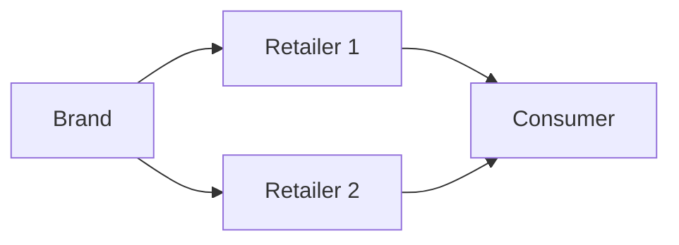
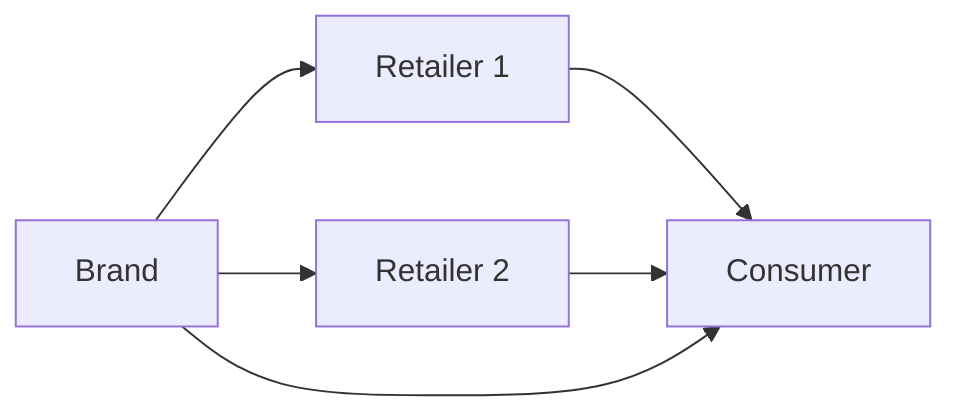

---
aliases:
  - Redefining the Digital Value Chain for Multi-Brand Retail
canonical: 'https://nebulab.com/blog/multi-brand-retail-strategy'
excerpt: Can multi-brand retailers eschew the race to the bottom?
publishedOn: 2024-12-04T00:00:00.000Z
status: evergreen
title: Redefining the Digital Value Chain for Multi-Brand Retail
---
Over the last couple of years, a lot has been written about [the rise and fall of Digitally-Native Vertical Brands (DNVBs)](https://www.retaildive.com/news/dtc-brands-are-dead-retail-wholesale-long-live-dtc/729365/). These players vowed to eliminate the middleman and sell their products exclusively online, seizing an incredibly profitable arbitrage opportunity that revolved around cheap advertising and meager interest rates.

As it turned out, this strategy was doomed to fail as the market saturated, advertising became more expensive, consumers resumed shopping in-store after the pandemic, and venture funding dried up. These (and a few more) factors led to a sharp and dramatic deflation of the DNVB bubble, with several giants falling from grace and having to file for bankruptcy or face drastic valuation adjustments.

Today, savvy commerce operators understand that DTC is a sales channel, not a business model, and must be deployed as part of a much more comprehensive marketing and distribution strategy to have a net positive impact on the brand. The result is a more mature retail scene, with operators that seek to be omnichannel and profitable from day one—a refreshing return to Brand Building 101.

However, one particular type of retailer has been struggling more than others to catch up to the new reality due to its unique business model and (in some cases) low digital maturity: the Multi-Brand Retailer (MBR).

In this article, we’re going to explore why MBRs have it harder than the rest and what they can do to establish, maintain, and further their competitive advantage.

## The Problem and Opportunity of Multi-Brand Retail

If retail is a tough business, multi-brand retail takes the difficulty level up a notch by eliminating product features from a retailer’s potential sources of competitive advantage. When you sell the same products as tens of other retailers, you need to give the consumer a reason to buy that product from you vs. the competition.

For brick-and-mortar MBRs, that reason has historically been mere geographic proximity. In the physical world, it’s impractical for the average consumer to travel long distances “just” to find a better deal or get a slightly better experience. As a result, many brick-and-mortar MBRs have historically operated a business of arbitrage, where their main job was to acquire and then monetize foot traffic.

Unfortunately, these retailers quickly realized that online shopping is a different game altogether. With every one of your competitors just a Google search (or, soon, [a Perplexity prompt](https://www.perplexity.ai/hub/blog/shop-like-a-pro)) away, the Internet is a giant comparison machine. It costs the digital consumer virtually no effort to find the best possible deal on that pair of boots they’re looking for.

To survive, most MBRs focused on the only factor within their immediate control: price. They deployed ever more aggressive discounting strategies in an effort to win the consumer’s business. Unfortunately, this resulted in a race to the bottom that destroyed their margins and diluted their brands. This phenomenon contributed to the demise of smaller, family-owned operations and larger, more established players—a prime example being [the recent sale of YNAP to Mytheresa.](https://www.voguebusiness.com/story/companies/without-farfetch-whats-next-for-ynap)

On the other hand, the same aspects that make multi-brand retail so complicated to crack also make it a high-potential business model. Unlike most mono-brand shopping destinations, MBRs can become a one-stop shop for entire product verticals or consumer segments, reaching more consumers and commanding larger wallet shares than a single brand could ever do.

But if price wars are not the way to do this, what is?

## Mapping the Actors Involved in Multi-Brand Retail

Before answering the question, it’s essential to map the actors involved in a multi-brand retail operation and how they typically interact.

In its most basic form, the relationship looks like this—a brand sells to a retailer, which in turn sells to the end consumer (often, things are slightly more complicated, but this simplification will work for the purpose of our article):

In reality, though, brands always sell through multiple retailers, which means the relationship graph _actually_ looks like this:

To make matters more complex, most brands _also_ sell directly to the consumer, either online or through their brick-and-mortar stores:

Each of these relationships creates opportunities and constraints for all the parties involved in the system. As a couple of examples:

- Brands need retailers in order to increase their market share and penetration. At the same time, most brands ultimately want customers to shop on their direct channels, where they can collect more data and increase their profits.
- Most consumers want the best price, which pressures retailers into offering discounts. At the same time, brands don’t want to dilute their market positioning or cannibalize their own channels, so they regulate product pricing and availability.

For a multi-brand retailer, there are many more similar contradictions to navigate—each brings challenges but also creates opportunities.

In fact, savvy operators are experts in creating outsized value for each actor in the ecosystem while “satisficing” all constraints. In doing so, the retailer eschews its transactional role as a mere middleman between the brand and the consumer and builds its own identity; in other words, the retailer becomes _its own brand._

This approach allows retailers to compete on factors other than value, such as product selection, customer experience, and value-added services, giving them more bargaining power (literally and figuratively) in their relationships with brands and consumers.

So far, this is all very theoretical. Let’s see what it looks like in practice by analyzing how multi-brand retailers can compete across three dimensions: Merchandising, Customer Experience, and Value-Added Services.

## A Retailer for Everyone Is a Retailer for No One

When it comes to merchandising, multi-brand retailers should lead with a strong value proposition, understanding what kind of consumer they want to serve and how they want to position themselves. This will serve as a North Star in determining not only product selection but the retailer’s entire go-to-market strategy.

Unfortunately, most MBRs err on the side of caution and try to be everything to everyone. This choice (or lack thereof) often spurs from the fear of alienating specific market segments. Unfortunately, it comes two significant drawbacks:

- It generates massive operational overhead for the retailer’s merchandising, marketing, logistics, and operations teams.
- It dilutes the retailer’s identity in the eyes of both consumers and brands, turning them into a commodified middleman rather than a standalone entity.

The primary value of a multi-brand retailer is to act as a tastemaker, helping consumers navigate the brand landscape through a distinct point of view. Retailers that neglect this aspect are giving up a significant competitive lever and will only be able to compete across other dimensions, further reducing their ability to maneuver in the market.

This is not to say that this approach can _never_ work. In fact, it’s exactly what Amazon does: it carries (or aims to carry) every single product from every single brand in every single category, generates massive efficiency through economies of scale, and reinvests those savings to compete exclusively on price and convenience.

Unfortunately, there can only be a handful of Amazons in the world; everyone else needs to take a stance if they want to stand out.

Furthermore, having a unique value proposition also enables and enriches the other two competitive dimensions we’re exploring in this article–customer experience and value-added services. Let’s see how.

## Nailing the Multi-Brand Customer Experience

Consumer expectations for customer experience have never been higher, as evidenced by [Shopify’s recent State of Commerce report](https://www.shopify.com/uk/enterprise/state-of-commerce-report-2024): Offering a modern, robust digital shopping experience is a must-have for anyone selling online today. Luckily, the technology to do so has been largely commoditized, and the playbooks are available for everyone to peruse and implement.

However, while mono-brand players may be able to settle for “good enough,” multi-brand retailers do not have that luxury. For an MBR, customer experience is a lever to exploit rather than a bar to clear. The reason for this is two-fold:

- As we’ve mentioned, multi-brand retailers rarely compete on product. As a result, customers will place more importance on the quality of the customer experience in a multi-brand retail context than they would for a mono-brand transaction since they have alternative shopping channels to choose from for that same product.
- Furthermore, multi-brand retailers lend themselves to higher AOVs and more frequent purchases, which means customers will be exposed to their shopping experience more often and deeply. Again, this means they will emphasize CX quality more than usual.

The leading multi-brand retailers understand this, and they create innovative shopping experiences that don’t settle for the bare minimum. Instead, they include advanced elements which may include any of the following:

- **Dynamic cross-selling:** MBRs can mix and match brands in ways that a customer wouldn’t (easily) be able to experience elsewhere. This can lead to cross-selling opportunities and contextual product recommendations.
- **Experience personalization**: By building a deep understanding of their audience, multi-brand retailers can create concierge experiences that help customers navigate what may be an otherwise intimidating product catalog.
- **Loyalty/membership programs:** Given that the ultimate goal of a multi-brand retailer is to become the one-stop shop for their customers, loyalty and membership programs can be highly impactful in improving customer retention—in some cases, they can even generate entirely new revenue streams.

All of these initiatives have the added benefit of helping the retailer collect data that can fuel merchandising decisions and further CX improvements.

In multi-brand retail, the customer experience is not just something you slap on top of the product. In fact, insofar as “product” is defined as the distinctive value the retailer offers its customers, customer experience is _the_ product they should worry about.

## Going the Extra Mile with Value-Added Services

Finally, multi-brand retailers can compete on what are typically called Value-Added Services (VAS). This is a broad term that often overlaps with the Customer Experience bucket. For the purpose of this article, we define VAS as any elements that are not part of the core shopping experience but are still perceived as valuable by the consumer.

Value-added services allow MBRs to create unique value that consumers couldn’t get through other channels—sometimes, not even through the brands’ direct-to-consumer channels. A few examples of VAS are:

- **Product alteration:** This may include services such as tailoring, embroidering, engraving, and any other product alteration and customization services relevant to the categories the MBR operates.
- **End-of-life options:** Through economies of scale, multi-brand retailers are well-positioned to offer customers the ability to repair, recycle, or resell their products. For example, [Net-a-Porter allows customers to resell products through Reflaunt.](https://netaporter.reflaunt.com/choose-your-location?redirect_url=%2F)
- **Community, content, curation, collabs:** [The 4Cs of the modern brand.](https://andjelicaaa.medium.com/4cs-of-the-modern-brand-8bb96c5b3597) Multi-brand retailers can expand their brand universe through community activations, bespoke and curated content, and collabs with adjacent verticals/categories.

Through Value-Added Services, multi-brand retailers build up their own brand, repositioning themselves from middlemen to value-creators in the consumer-brand relationship and adding a new dimension to their competitive strategy.

## Where to Start?

In this (very long) piece, we’ve seen how MBRs can stay competitive by identifying a distinctive and compelling value proposition, offering a best-in-class and innovative customer experience, and investing in value-added services to build a standalone brand.

Nebulab friend and [Commerce Thinking](https://www.commercethinking.com/) co-founder Luke Hodgson, interviewed for this piece, shares our perspective:

> The economics of multi-brand retail demands a precise approach to everything, particularly digital merchandising. Without the cushion of production margins or brand marketing budgets and faced with high return rates, particularly in luxury fashion, successful MBRs master a different kind of value creation.
>
> Rather than competing on price or rushing to discount, \[multi-brand retailers\] become curators of lifestyle – they’re crafting immersive digital and IRL experiences through photography, detailed product storytelling, and carefully constructed edits that speak directly to their customer. The future belongs to those who can understand and influence their customer’s style journey better than the brands themselves.

With that said, it’s also important to acknowledge that most of these investments require significant time, advanced know-how, and deep pockets. Very few retailers have the capabilities or the means to pursue a full-blown digital strategy from day one.

As always, we suggest [talking to your customers,](https://nebulab.com/blog/ecommerce-product-management) starting from low-hanging opportunities, and using data to iterate in a disciplined and intentional way. By truly understanding what their customers care about, MBRs can focus relentlessly on the areas more likely to make a difference and ignore everything else.

Over the following years, e-commerce will only get more challenging for MBRs as new players enter the market and brands ramp up their direct channels. While adjusting to this new reality may prove expensive, we believe that failing to keep up will further reduce a retailer’s competitiveness—and may ultimately prove fatal.
